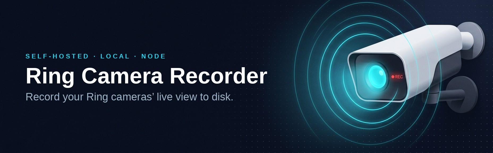

# Ring Camera Recorder

<p align="center">
  
</p>

Self-hosted tool that **locally records the live view from Ring cameras you own**. It captures
the freely available live stream (not Ring's paid cloud storage), so it works **without a Ring
Protect subscription**. It records your own cameras and your own footage. Read the
[Legal & responsible use](#legal--responsible-use) section before using or sharing it.

> **You are recording the live stream, not downloading cloud history.** Without a Ring
> Protect subscription, Ring stores nothing in the cloud, so there is no event history to
> retrieve. This tool grabs the *live view* feed (the same one the app shows you for free)
> and writes it to disk, either on demand or automatically when a motion/doorbell event
> fires. That is the only no-subscription path.

## What it does

- Authenticates to your Ring account once (email + password + 2FA) and stores a
  **refresh token**. Your password is never saved or hardcoded.
- Lists your cameras.
- Records the live stream to `recordings/{camera}_{ISO8601}.mp4`.
- Auto-records a clip when a camera reports **motion** or a doorbell **ding**.
- Manual "record now for N seconds" and continuous modes.
- Optional retention: delete clips older than N days.

## Requirements

- Node.js >= 20 (tested on 22).
- `ffmpeg` available on `PATH` (`ffmpeg -version` should work).
- A Ring account with at least one camera.

## Setup

```bash
npm install

# One-time interactive login. Prompts for email, password, and the 2FA code Ring
# texts/emails you, then writes the refresh token to .ring-token.json.
npm run auth

# Optional: copy and edit the config.
cp config.example.json config.json

# List your cameras (confirms auth works and shows names/ids for the `cameras` filter).
npm run list
```

## Usage

```bash
# Long-running service: watches for motion/ding and auto-records per config.json.
npm run build && npm start
# (during development you can skip the build step with: npm run dev)

# Record a single clip right now (default camera selection, default length):
npm run record -- --camera "Front Door" --seconds 30

# Full end-to-end verification (run after `npm run auth`): authenticates, lists
# cameras, captures a clip, probes it for video/audio, and (optionally) waits for
# a real motion/ding to confirm auto-recording. Trigger motion when prompted.
npm run verify -- --watch-motion 60
```

## Tests

```bash
npm test   # builds, then runs hermetic logic tests (no Ring account needed)
```

Covers the filename convention, retention pruning, and the motion/ding trigger state
machine (rising-edge detection, no-overlap-while-recording, cooldown suppression,
doorbell-only-on-doorbots). The live network path is exercised separately by
`npm run verify` once you have a token.

## Configuration

Config is layered: built-in defaults < `config.json` < `config.local.json` < environment
variables. See `config.example.json`. Key fields:

| Field | Default | Meaning |
|-------|---------|---------|
| `tokenPath` | `.ring-token.json` | Where the refresh token lives. |
| `outputDir` | `recordings` | Where clips are written. |
| `clipLengthSeconds` | `30` | Default clip length for events + manual record. |
| `cameras` | `"all"` | `"all"` or an array of name substrings / numeric ids. |
| `recordOnMotion` | `true` | Auto-record on motion events. |
| `recordOnDing` | `true` | Auto-record on doorbell press. |
| `motionCooldownSeconds` | `20` | Min gap between auto-recordings per camera. |
| `retentionDays` | `null` | Delete clips older than N days. `null` = keep all. |
| `retentionSweepMinutes` | `60` | How often retention runs while the service is up. |

Environment overrides: `RING_TOKEN_PATH`, `RING_OUTPUT_DIR`, `RING_CLIP_SECONDS`,
`RING_RETENTION_DAYS`, `RING_DEBUG=1`.

## Triggering policy

When a motion/ding event fires, `src/events.ts` decides whether to start a clip. The
default `shouldTrigger()` policy:

- **Skips** if a recording for that camera is already running (no overlapping ffmpeg jobs).
- Enforces `motionCooldownSeconds` between the *start* of consecutive clips.

If you want "extend while motion persists" instead of fixed-length clips, or a different
cooldown, edit `shouldTrigger()`; it's deliberately isolated for that. One
no-subscription caveat: a clip can only begin *after* the event arrives, so there's no
pre-roll buffer (you lose the ~1-2s before the trigger).

## Running as a background service

- **systemd**: see `deploy/ring-camera-recorder.service` (header has install steps).
- **pm2**: `pm2 start deploy/ecosystem.config.cjs`.

Run `npm run auth` manually first: the login is interactive and the service only reads
the saved token.

## Limitations (no subscription)

- **Live-only.** No access to past clips / cloud event history; those require Ring Protect.
- Motion/ding **push notifications are still delivered free**, which is what triggers
  auto-recording.
- Battery-powered cameras spin up the radio for each live stream, so frequent
  motion-triggered recording will drain the battery faster than passive monitoring.
- Ring may throttle accounts that open live streams very aggressively; keep clip lengths
  and cooldowns reasonable for 24/7 use, or use a locally-streaming camera instead.

## Security

The refresh token in `.ring-token.json` grants full access to your Ring account. It is
gitignored, written with `0600` permissions, and rotated tokens are persisted
automatically. Treat that file like a password.

`npm audit` reports a high-severity advisory in a transitive WebRTC dependency (`ip` via
`werift`). It is **not** in this project's code, is low-risk for personal use, and
**cannot be fixed without breaking streaming**. Do not run `npm audit fix --force`. See
[`SECURITY.md`](./SECURITY.md) for the full assessment and how to report issues.

## Contributing

Issues and pull requests are welcome. This is a small, best-effort project maintained in
spare time. Keep PRs focused, and note that the Ring integration depends on an
unofficial upstream API that can break without notice (see [`SECURITY.md`](./SECURITY.md)).
For anything security-related, follow `SECURITY.md` rather than opening a public issue.

By contributing, you agree your contributions are licensed under the MIT License (see
[`LICENSE`](./LICENSE)).

## Legal & responsible use

**This is not legal advice.** Use this tool at your own risk. By using it you accept
responsibility for complying with the laws and agreements that apply to you.

- **Your own cameras only.** Use this exclusively with cameras on a Ring account you
  control, authenticating with your own credentials. It is a tool for recording *your own*
  footage, not for accessing anyone else's account, cameras, or data.

- **Audio recording / consent.** Clips include **audio**. Many jurisdictions have
  two-party / all-party consent ("wiretapping") laws. In some U.S. states and other
  countries, recording other people's audio without consent can carry **civil and even
  criminal** liability, independent of Ring. Recording your own property is generally fine;
  capturing other people's conversations may not be. Know your local laws before recording,
  and consider disabling audio where required.

- **Ring Terms of Service.** This relies on `ring-client-api`, which uses Ring's
  **unofficial** API. Automated/unofficial access may violate Ring's / Amazon's Terms of
  Service, and **Ring could suspend accounts** that use it. There is no guarantee of
  continued access; Ring can change or block the API at any time (e.g. the 2026
  `/oauth/v2` auth migration; see the upstream `dgreif/ring` issues).

- **Not affiliated with Ring.** This project is independent and is **not** affiliated with,
  authorized, endorsed, or sponsored by Ring LLC or Amazon. "Ring" is a trademark of its
  owner, used here only to describe interoperability. See [`NOTICE`](./NOTICE).

- **No warranty.** Provided "as is" under the [MIT License](./LICENSE), without warranty of
  any kind. The authors are not liable for account suspensions, lost recordings, missed
  events, or any other damages arising from use.
